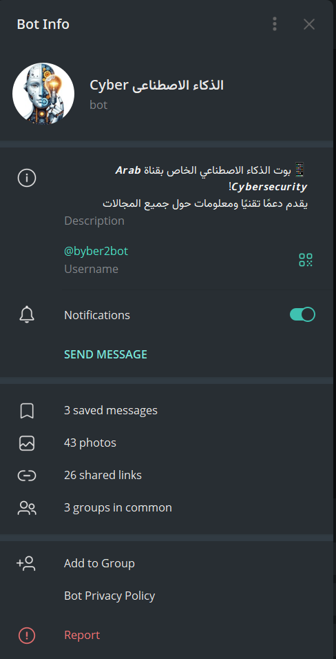

#  Smart Student Assistant Bot

Welcome to the **Smart Student Assistant Bot** project! This bot is designed to be a powerful study companion on Telegram, leveraging the AI capabilities of **Google Gemini** to assist with a wide range of academic tasks.

---

## Bot Screenshots


---
Check out my Telegram bot: [Abu Ras Bot](https://t.me/byber2bot)

[](https://t.me/byber2bot)

## ✨ Key Features

-  **Intelligent Conversations**: Interact with the latest AI models from Gemini to get answers to your questions, explanations for complex concepts, and help with your assignments.  
-  **Image Analysis**: Send an image containing a question, diagram, or any educational content, and the bot will analyze it and provide a detailed explanation.  
-  **Web Search**: Search the web directly from the bot to get the latest information and resources.  
-  **Group Management**: The bot can interact within groups, responding to questions when triggered with the keyword `cyber`.  
-  **Admin Dashboard**: A powerful dashboard for admins to manage users, send announcements, view statistics, and manage groups.  
-  **Mandatory Subscription System**: Option to require users to subscribe to a specific channel before using the bot.

---

##  Technologies Used

- **Programming Language**: Python 3  
- **Bot Library**: python-telegram-bot  
- **AI**: Google Gemini API (Pro & Vision)  
- **Web**: Flask (for receiving Telegram updates via Webhooks)  
- **Database**: Simple JSON file (easily extendable)  

---

##  Setup and Running

### 1. Clone the project

```bash
git clone https://github.com/waheeb71/cyber_ai_bot.git
cd cyber_ai_bot
````

### 2. Install dependencies

```bash
pip install -r requirements.txt
```

### 3. Configure environment variables

Create a `.env` file in the project root and add the following:

```env
TELEGRAM_TOKEN="YOUR_TELEGRAM_BOT_TOKEN"
GEMINI_API_KEY="YOUR_GEMINI_API_KEY"
ADMIN_NOTIFICATION_ID="YOUR_TELEGRAM_USER_ID" # Admin Telegram user ID
```

* **TELEGRAM\_TOKEN**: Your bot token from BotFather.
* **GEMINI\_API\_KEY**: Your API key from Google AI Studio.
* **ADMIN\_NOTIFICATION\_ID**: Telegram user ID of the admin to receive notifications.

### 4. Run the bot

```bash
python main.py
```

The bot will use **Webhooks** if `WEBHOOK_URL` is provided (useful for cloud environments like Render); otherwise, it will run in **Polling** mode.


---

##  Contact:
For questions or support, contact me via:
- Telegram: [@SyberSc71](https://t.me/SyberSc71)
- Telegram: [@WAT4F](https://t.me/WAT4F)
- GitHub: [waheeb71](https://github.com/waheeb71)
- GitHub2: [cyberlangdev](https://github.com/cyberlangdev)
- **Location:** I am from Yemen, Taiz.
- **YouTube Channel:** [Cyber Code](https://www.youtube.com/@cyber_code1)
- **X (formerly Twitter):** [@wa__cys](https://x.com/wa__cys)

---
## Author / المطور

**English:** Waheeb Mahyoob Al-Sharabi (Waheeb Al-Sharabi)  
**العربية:** هيب مهيوب الشرعبي (هيب الشرعبي)

---

## Acknowledgements

This project is based on [cyber_ai_bot](https://github.com/waheeb71/cyber_ai_bot) by Waheeb Al-Sharabi.  
We modified and extended the original project while giving full credit to the original author.

